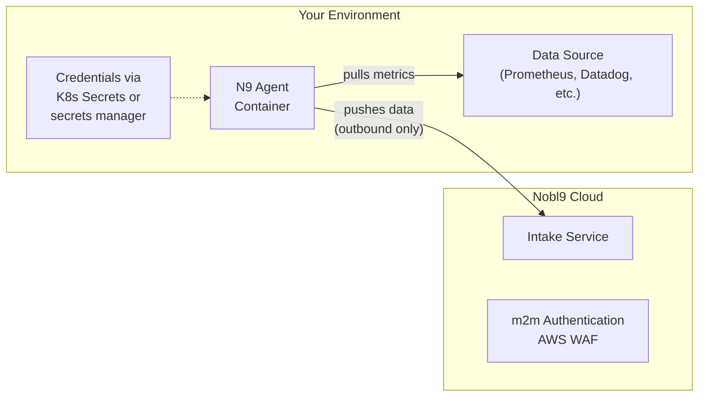
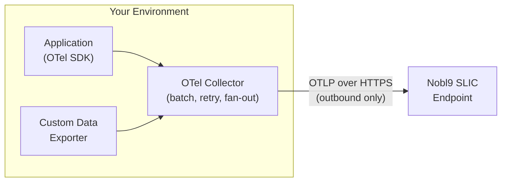
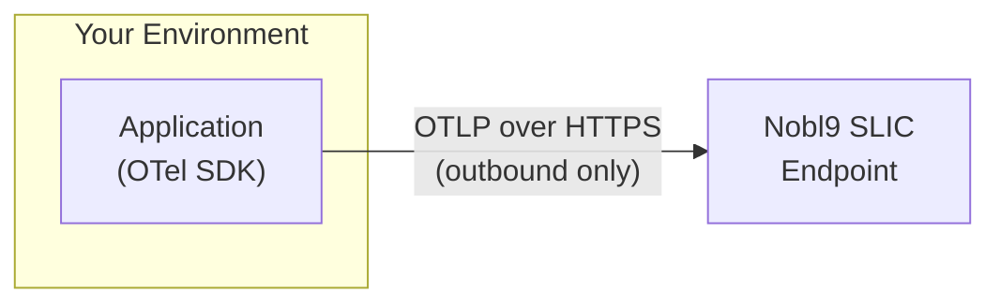

# 10. Appendices


## 10.1 Appendix A: SLO Specification Template


| Field | Value |
| --- | --- |
| SLO Name | [e.g., payments-api-availability] |
| Display Name | [e.g., Payments API Availability] |
| Service | [e.g., payments-api] |
| Project | [e.g., checkout-team] |
| SLI Description | [e.g., Percentage of HTTP requests returning 2xx/3xx] |
| SLI Type | [Availability / Latency / Throughput / Correctness] |
| Metric Source | [e.g., Datadog, query: sum:http.requests.success{...}] |
| Budgeting Method | [Occurrences / Time Slices] |
| Target | [e.g., 99.9%] |
| Time Window | [e.g., 30-day rolling / Monthly calendar-aligned] |
| Layer | [User Journey / Application / Service / Platform / Infrastructure / Dependency] |
| Tier | [Critical / High / Medium / Low] |
| Owner | [e.g., checkout-backend@company.com] |
| Error Budget Policy | [Link to policy document] |
| Alert Policies | [Fast-burn: 20x/5min, Slow-burn: 2x/6hr, Budget: 25%, 10%] |
| No-Data Alert | [Threshold: 5 min, Method: PagerDuty + Slack] |
| Review Cadence | [Weekly operational, Monthly target review] |
| Labels | [team: checkout, tier: critical, layer: application, env: production] |
| Annotations | [runbook: ..., oncall: ..., repo: ..., dashboard: ...] |
| Created Date | [YYYY-MM-DD] |
| Last Reviewed | [YYYY-MM-DD] |


## 10.2 Appendix B: Data Source Integration Guide

Nobl9 supports three methods for getting SLI data into the platform: **Agent**, **Direct**, and **SLI Connect**. Each method has distinct architecture, security, and operational trade-offs. This appendix provides practical guidance for choosing and configuring the right integration pattern for each data source.

> :material-book-open-variant: **Docs:** [Data Sources](https://docs.nobl9.com/sources/)

> :material-book-open-variant: **Docs:** [Agent vs. Direct Connection](https://docs.nobl9.com/slocademy/n9-agent/direct-vs-agent)

> :material-book-open-variant: **Docs:** [Nobl9 Agent](https://docs.nobl9.com/nobl9-agent/)


### 10.2.1 Integration Methods at a Glance

| Property | Agent | Direct | SLI Connect |
| --- | --- | --- | --- |
| Data flow direction | Agent pulls from your data source, pushes to Nobl9 (outbound only) | Nobl9 connects inbound to your data source | Your applications push metrics to Nobl9's SLIC endpoint |
| Credentials stored in Nobl9 | No. Credentials remain in your environment. | Yes. Encrypted and stored in Nobl9. | Nobl9 API key used for authentication. No data-source credentials involved. |
| Requires deployment in your infra | Yes. Runs as a container (Kubernetes or Docker). | No. Nobl9 connects directly to your data source API. | Optional. OpenTelemetry Collector can be deployed, or applications can push directly. |
| Inbound ports required | None. All connections are outbound. | Yes. Must open a port and allowlist Nobl9 IP addresses. | None. Your applications make outbound HTTPS calls. |
| Setup complexity | Higher. Requires K8s/Docker deployment and credential injection. | Lower. Configure credentials in the Nobl9 UI or YAML. | Moderate. Requires instrumentation or collector configuration. |
| Query language | Native to data source (PromQL, Datadog queries, etc.) | Native to data source | PromQL-compatible (queries written against SLIC's Prometheus-flavor store) |
| Best for | Production environments with strict network security | Non-production environments or SaaS data sources with public APIs | Custom metrics, synthetic SLIs, business KPIs, or data sources without a native Nobl9 integration |


### 10.2.2 Choosing an Integration Method

Use this decision tree to select the right method for each data source:

1. **Is your data source natively supported by Nobl9?** If not, use SLI Connect to push custom metrics.
2. **Does your network policy allow inbound connections from Nobl9?** If not, use Agent.
3. **Do security requirements mandate that credentials stay within your environment?** If yes, use Agent.
4. **Is this a non-production or SaaS-hosted data source with a public API?** Direct is the simplest option.
5. **Do you need to derive SLIs from custom business logic, synthetic checks, or non-metric data?** Use SLI Connect with a custom exporter.

**Data Source Compatibility:**

Most Nobl9 data sources support both Agent and Direct methods. The following data sources are Agent-only:

- Amazon Prometheus
- Coralogix
- Elasticsearch
- Grafana Loki
- Graphite
- OpenTSDB
- Prometheus

For these sources, plan for Agent deployment as part of your initial setup.


### 10.2.3 Agent Integration

The Nobl9 Agent is a lightweight container that pulls SLI metrics from your data sources and pushes them to Nobl9. It queries data sources at a configurable interval (default: every 60 seconds) using each source's native API.

**Architecture:**



**Deployment Options:**

| Platform | Use Case | Notes |
| --- | --- | --- |
| Kubernetes | Production deployments | Recommended. Deploy as a Deployment or DaemonSet. Use K8s Secrets for credentials. |
| Docker | Local testing and development | Not recommended for production. Data collection stops when the host machine sleeps. |

**Agent Configuration Best Practices:**

- Deploy agents in the same network segment as the data sources they query to minimize latency and avoid cross-zone traffic costs.
- Use Kubernetes Secrets or a secrets manager (Vault, AWS Secrets Manager) to inject credentials. Avoid inline environment variables, which are visible in `kubectl describe` output.
- Set the `N9_METRICS_PORT` environment variable to expose agent health metrics at `/metrics` for monitoring the agent itself.
- Pin agent versions in your deployment manifests rather than using `latest`. The current stable version is `0.107.2`.
- For Prometheus data sources behind a reverse proxy, note that the Nobl9 Agent does not support authentication proxies (HTTP Basic Auth or client certificates). Use SLI Connect as an alternative in these scenarios.
- Configure query delay environment variables (e.g., `PROM_QUERY_DELAY`) to account for data source ingestion lag and avoid querying incomplete data windows.

**Agent Credential Environment Variables:**

```yaml
env:
  - name: N9_CLIENT_ID
    valueFrom:
      secretKeyRef:
        name: nobl9-agent-credentials
        key: client-id
  - name: N9_CLIENT_SECRET
    valueFrom:
      secretKeyRef:
        name: nobl9-agent-credentials
        key: client-secret
```


### 10.2.4 Direct Integration

Direct connections let Nobl9's servers connect to your data source API to pull metrics. No agent deployment is required.

**When to Use Direct:**

- The data source is a SaaS platform with a public API (e.g., Datadog, New Relic, Splunk Cloud).
- Your network allows inbound connections from known IP addresses.
- You want the simplest possible setup for non-production or low-security environments.

**Security Considerations:**

- You must allowlist Nobl9's IP addresses in your firewall rules. IP addresses differ by Nobl9 instance (app.nobl9.com vs. us1.nobl9.com). See the Nobl9 documentation for current IP addresses.
- Data source credentials are encrypted and stored in Nobl9. If your security policy prohibits third-party credential storage, use Agent instead.
- Use read-only service accounts for all Direct connections. Nobl9 only needs query access.


### 10.2.5 SLI Connect (SLIC)

SLI Connect allows you to push custom SLI metrics directly to Nobl9 rather than having Nobl9 pull from a data source. This is the right choice when your SLI data does not live in a natively supported monitoring tool, or when you need to compute SLIs from custom business logic.

**Supported Protocols:**

| Protocol | Format | Notes |
| --- | --- | --- |
| OpenTelemetry (OTLP) | OpenTelemetry Line Protocol | Metrics only. Traces and logs are discarded. |
| InfluxDB | Telegraf Line Protocol | Compatible with InfluxDB's write API format. |
| Prometheus | OpenMetrics | Standard Prometheus exposition format. |

**Architecture — With OpenTelemetry Collector (Recommended):**



The Collector provides batching, retry logic, and the ability to fan out metrics to multiple backends.

**Architecture — Direct from Application (No Collector):**



Simpler to set up, but lacks the buffering and reliability of the Collector. Suitable for development or low-volume use cases.

**OpenTelemetry Collector Configuration:**

```yaml
exporters:
  otlphttp/nobl9-slic:
    endpoint: 'https://api.slic.nobl9.com/opentelemetry'
    headers:
      authorization: 'Basic <base64(clientID:clientSecret)>'

service:
  pipelines:
    metrics:
      receivers:
        - otlp        # or prometheus, hostmetrics, etc.
      processors:
        - batch
      exporters:
        - otlphttp/nobl9-slic
```

Alternatively, configure the exporter via environment variables:

```bash
OTEL_EXPORTER_OTLP_ENDPOINT="https://api.slic.nobl9.com/opentelemetry"
OTEL_EXPORTER_OTLP_HEADERS="Authorization=Basic <base64(clientID:clientSecret)>"
```

**Authentication:**

SLI Connect uses HTTP Basic Authentication with your Nobl9 Client ID as the username and Client Secret as the password. Any Nobl9 user in your organization can send metrics to SLIC, but we recommend creating a dedicated service user for automated pipelines, similar to the approach for sloctl in CI/CD.

**Querying SLIC Data:**

- Data sent to SLI Connect is available for SLO queries through a Prometheus-flavor data source named "Nobl9 SLI Connect" that is automatically created in your Nobl9 organization.
- Write SLO queries against SLIC data using PromQL-compatible syntax.
- Explore your SLIC data interactively at `https://explore.slic.nobl9.com/app/{organization}/explore`.

**When SLI Connect is the Right Choice:**

- Your SLI data comes from a source without a native Nobl9 integration (e.g., a custom database, an internal API, a third-party service).
- You need to compute SLIs from business logic (e.g., percentage of orders fulfilled within SLA, payment success rate from a custom ledger).
- Your Prometheus instance is behind an authentication proxy that the Nobl9 Agent does not support.
- You want to consolidate metrics from multiple sources into a single SLI pipeline using the OpenTelemetry Collector.
- You are already using OpenTelemetry instrumentation and want to send the same metrics to Nobl9 alongside your existing observability backend.


### 10.2.6 Integration Decision Matrix

| Scenario | Recommended Method | Rationale |
| --- | --- | --- |
| Prometheus in a private network | Agent | Agent-only data source. No inbound ports needed. |
| Datadog (SaaS) in production | Agent or Direct | Both supported. Agent if credentials must stay local; Direct for simplicity. |
| New Relic in a staging environment | Direct | SaaS with public API. Low security risk in non-production. |
| Custom business KPI from an internal database | SLI Connect | No native integration. Build a custom exporter to push metrics via OTLP. |
| Prometheus behind NGINX with mTLS | SLI Connect | Agent does not support authentication proxies. Push metrics via OTel Collector instead. |
| Elasticsearch logs for error rate SLI | Agent | Agent-only data source. |
| Synthetic monitoring results from a custom tool | SLI Connect | Push synthetic check results as metrics via OTLP or OpenMetrics. |
| CloudWatch in an AWS environment with strict IAM | Agent | Credentials stay in your AWS account. Agent assumes IAM role. |
| Multiple data sources consolidated into one SLI | SLI Connect | OTel Collector can receive from multiple sources and export a unified metric to SLIC. |

